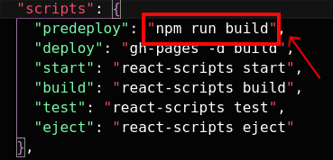

# React challenge repository

Here you will find a simple landing page developed to offer shared babysitting services and more.

## How to run the application in development mode

1. Clone this repository in your local machine:
	```sh
	git clone git@github.com:Qu4k3r/Qu4k3r-react-challenge-001ft.git
	```

	or, if you don't have a stored SSH key:
	```sh
	git clone https://github.com/Qu4k3r/Qu4k3r-react-challenge-001ft.git
	```

	- Now, enter the project directory:
	```sh
	cd Qu4k3r-react-challenge-001ft
	```

2. Get the latest npm version before installing dependencies:

	_Chose `npm` or `yarn`_:

	- npm:
		```sh
		npm install npm@latest -g
		```

	- yarn:
		```sh
		yarn set version latest
		```

1. Installing dependencies and running application in development mode:

	- Installing dependencies:
		```sh
		npm install
		```

		```sh
		yarn
		```

	- Running application:
		```sh
		npm start
		```

		```sh
		yarn start
		```

	The project should open in a new tab of your browser at any moment.

## How to build the application

By the time you installed the dependencies, the application was ready to be built, so all you have to do is run one of the following commands:

```sh
npm run build
```

```sh
yarn build
```

And finally:

```sh
npm run deploy
```

```sh
yarn run deploy
```

>Note: if you are using yarn, you'll probably have to modify the `package.json` file. But no worries, is actually simple! Take the next step if this is your case.

### **For `yarn` users:**

1. Open the `package.json` locatd in the project's root directory;
2. Look for the object key `scripts`;
3. There's another key in there called `predeploy`, change its value for `"yarn build"` and ... that's it! You're ready to go! If you're not sure how to proceed, here, take a look at this picture, it will help you out:

	

1. Run the latest two commands in order to deploy the application properly.

---
## Last considerations

I'd like to thank all people from Jungle Devs company for this amazing opportunity!

Even I can't get the job position as a Front End developer, for me was such a great challenge be part of this selective process because there were so many things that I thought I woudn't be able to get them done, but I put a lot of effort on myself like I never did before.

Besides that I'd like to apologize if the design is not good enough or if there's some other feature that was supposed to be here and it's not. I know that's not perfect at all and there is so much to be improved, done and implemented.

I'm really excited for what the future is bringing me and I'm ready to take more challenges!

I'm looking forward for feedbacks! Thank you and enjoy my application!

> Note: I know how to work with Sass but I decided not to do it here. Instead, I tried to implement some kind of pattern using the standard Cascade Styling Sheets.

---

_Author: Lucas Neves de Oliveira_
